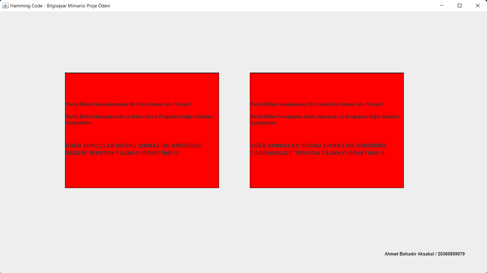
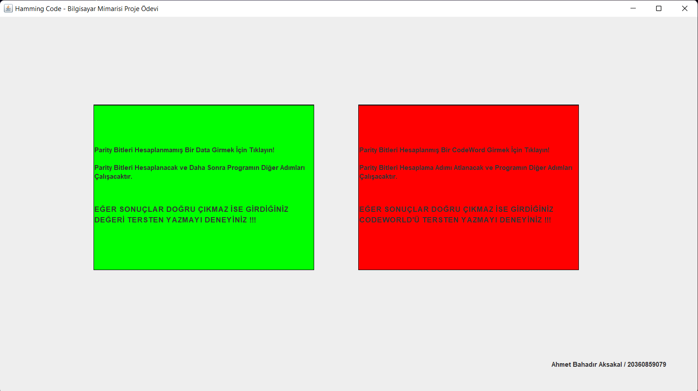
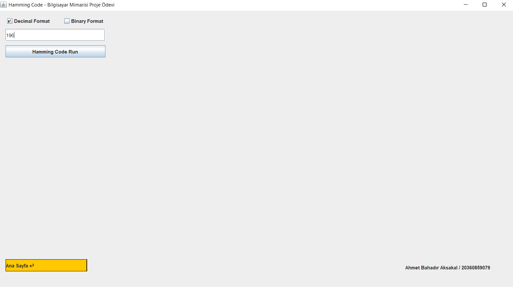
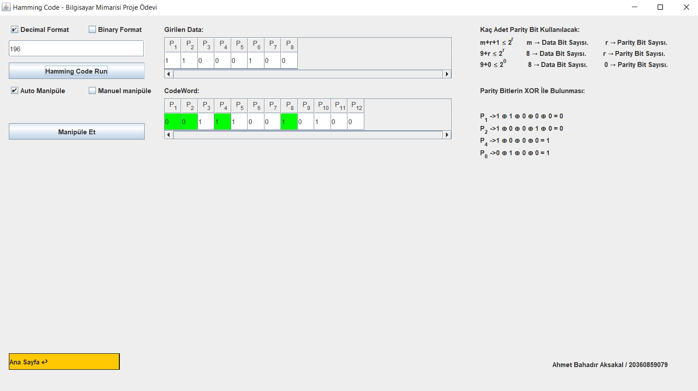
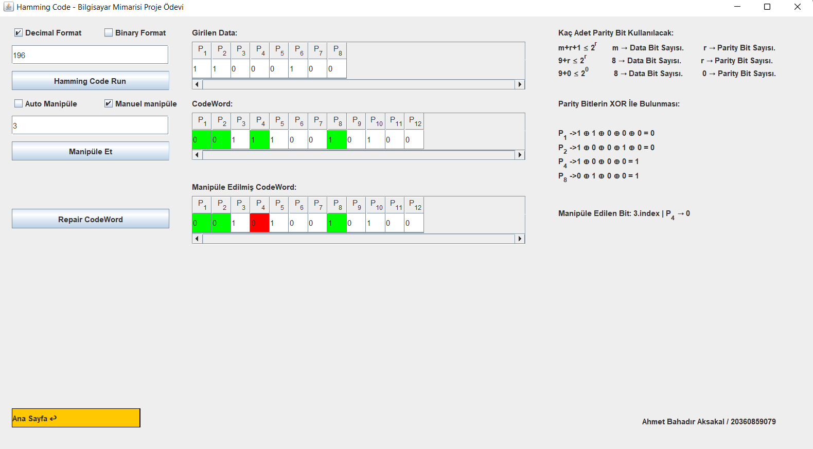
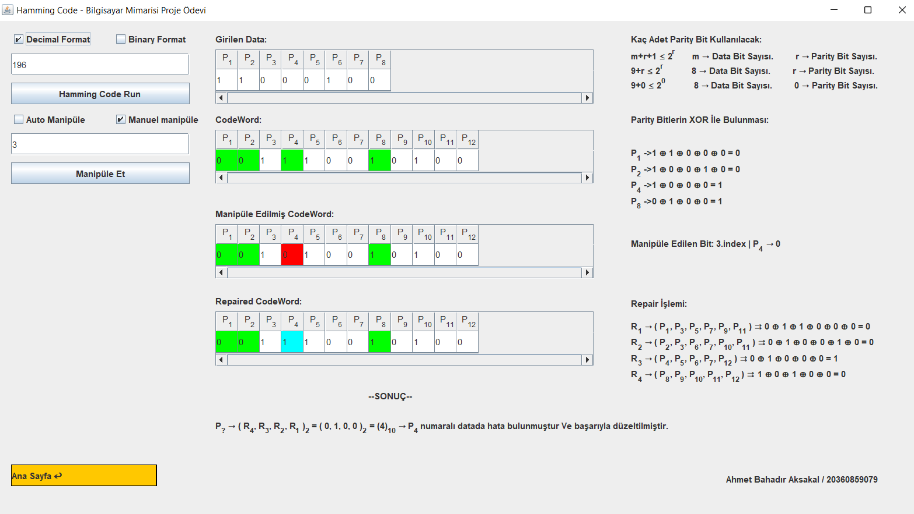
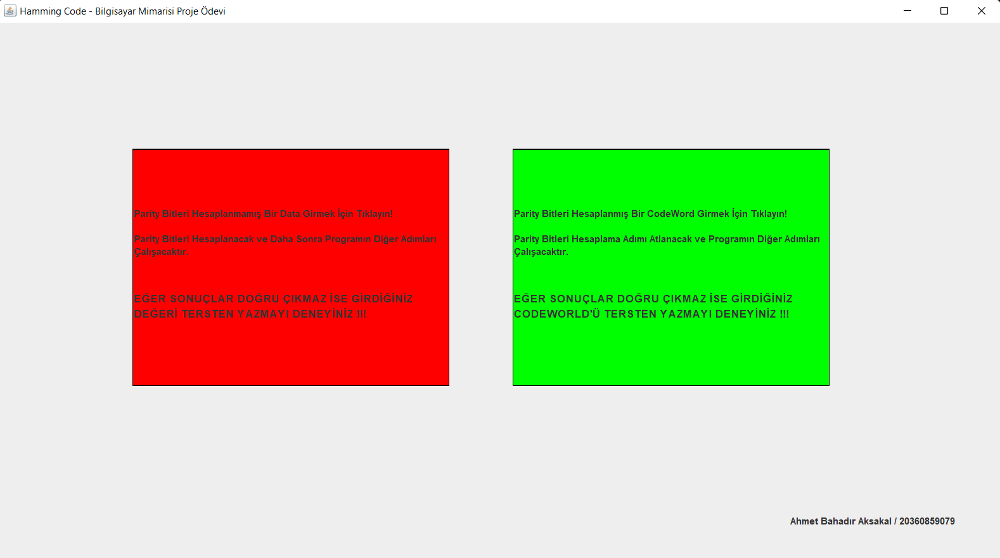
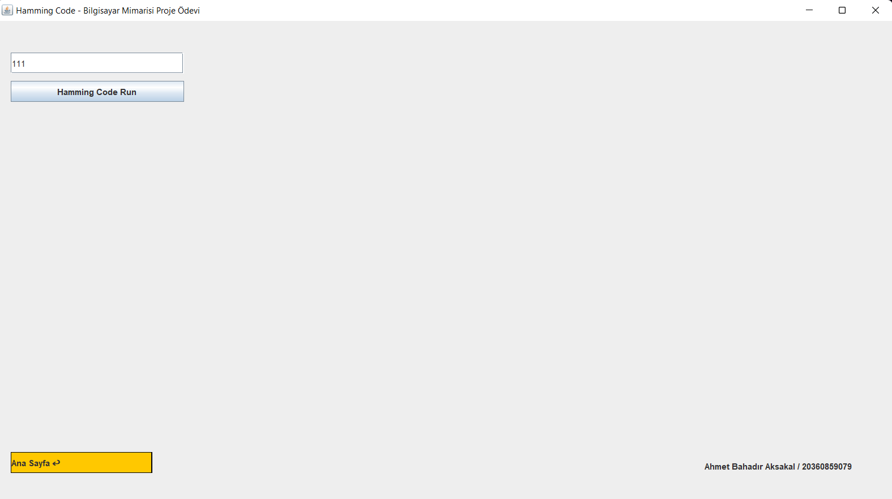
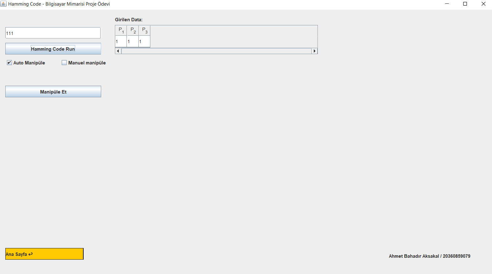
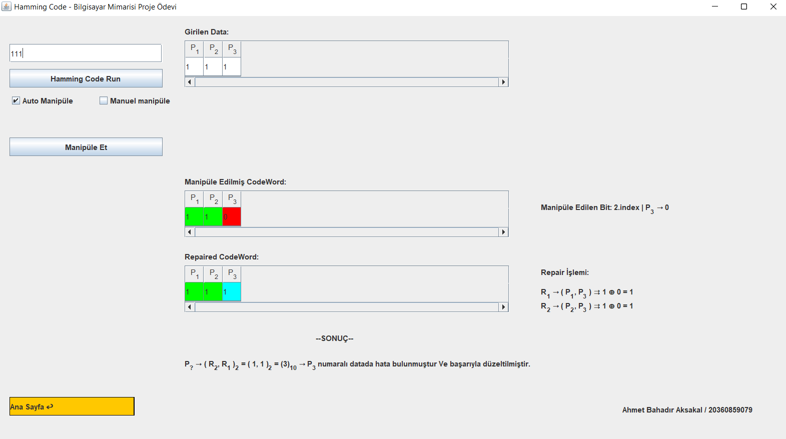

<h2 align="center">Hamming Code Genarator With Gui</h2>
<h3 align="center" color="Darkblue">Ahmet Bahadır Aksakal</h3>
<h4 align="center" color="Darkblue">20360859079</h4>
<h5 align="center" color="Darkblue">2. Sınıf Bahar Dönemi Bilgisayar Mimarisi Dersi Proje Ödevim</h5>

<ol>
  <li>
      <h3 color="Red">Projede Kullanılan Teknoloji Ve Diller:</h3>
      <ul>
        <li>Java</li>
        <li>Java Swing</li>
      </ul>
  </li>
   <li>
      <h3 color="Red">Projenin Amacı: </h3>
      <ul>
        <li>Bu projede Hamming Codu üretebilen ve Hatalı biti bulup düzeltebilen bir program geliştirilmiştir.</li>
        <li>Her bir işlem adımı gui üzerinden takip edilebilir.</li>
        <li>Bu proje ile öğrencilerin hamming codunu daha hızlı ve en iyi şekilde kavraması amaçlanmıştır</li>
        <li>Bu proje sayesinde öğrenciler kendi oluşturdukları hamming code'u test edebilirler</li>
      </ul>
  </li>
  <li>
      <h3 color="Red">Nasıl Kullanılır:</h3>
      <ul>
        <li>Ana Sayfada Seçim Yapabileceğiniz İki Seçenek Buluyor. </li>
        <li>İlk seçenek verilen binary bir data için parity bitleri oluşturur.</li>
        <li>Parity bitleri oluşturulduktan sonra CodeWord'ünüzün bir bitini manipüle (Bozar) eder. </li>
        <li>Program bozulan biti tespit eder ve onarır</li>
        <li>Bu işerli yaparken, nasıl yapıldığını ve hangi değerleri kullanıldığını sağ tarafta görebilirsiniz.</li>
      </ul>    
      <h4>UYARI: İNTERNETTE BAZI KAYNAKLARDA HAMMİNG CODE TERS YAZILMAKTADIR EĞER BİR UYUMSUZLUK YADA HATA İLE KARŞILARSINIZ LÜTFEN KODU TERSEN YAZIN PROGAM          BAŞARIYLA ÇALIŞACAKTIR</h4>
  </li>
  <li>
      <h3 color="Red">Görseller:</h3>
      <ul>
        <li></li>
        <li></li>
        <li></li>
        <li></li>
        <li></li>
        <li></li>
        <li></li>
        <li></li>
        <li></li>
        <li></li>
        <li></li>
      </ul>
  </li>
</ol>

  
    

