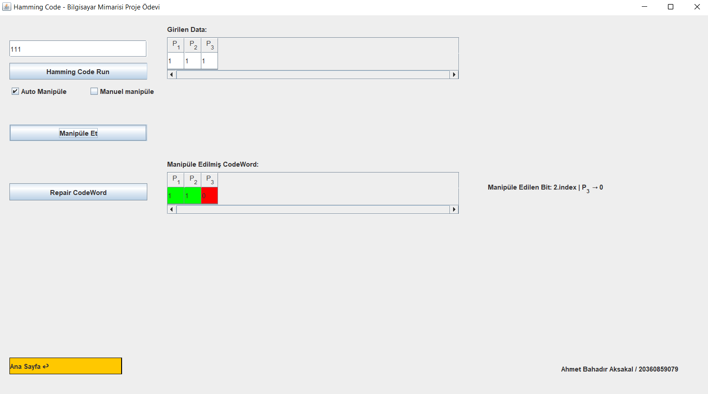

# Hamming Code Genarator With Gui

### Ahmet Bahadır Aksakal

#### 20360859079

****

- [EN : Description :book: :leftwards_arrow_with_hook:](#en)  
- [TR : Açıklama :book: :leftwards_arrow_with_hook:](#tr)

****

#### [EN]

## 2\. My Spring Semester Computer Architecture Course Project Assignment

1. ### Technology and Languages Used in the Project:
    
     * java
     *Java Swing
      
2. ### Purpose of the Project:
    
     * In this project, a program that can generate Hamming Code and find and fix the faulty bit has been developed.
     * Each transaction step can be followed through the gui.
     * With this project, it is aimed for students to understand Hamming code faster and in the best way.
     * Thanks to this project, students can test the hamming code they have created.
    
3. ### How to Use:
    
     * You Find Two Options to Choose from on the Home Page.
     * The first option creates parity bits for a given binary data.
     * Manipulates (Disrupts) a bit of your CodeWord after the parity bits are created.
     * The program detects and repairs the broken bit
     * While doing this, you can see how it is done and what values are used on the right.
    
     #### WARNING: THE HAMMING CODE IS WRITTEN REVERSE IN SOME SOURCES ON THE INTERNET. IF YOU EXPERIENCE AN INCOMPATIBILITY OR ERROR, PLEASE WRITE THE CODE REVERSE AND THE PROGAM WILL WORK SUCCESSFULLY.
    
4. ### Images:
    
    *   
    *   
    *   
    *   
    *   
    *   
    *   
    *   
    *   
    *   
    *   

****
****

#### [TR]

## 2\. Sınıf Bahar Dönemi Bilgisayar Mimarisi Dersi Proje Ödevim

1.  ### Projede Kullanılan Teknoloji Ve Diller:
    
    *   Java
    *   Java Swing
      
2.  ### Projenin Amacı:
    
    *   Bu projede Hamming Codu üretebilen ve Hatalı biti bulup düzeltebilen bir program geliştirilmiştir.
    *   Her bir işlem adımı gui üzerinden takip edilebilir.
    *   Bu proje ile öğrencilerin hamming codunu daha hızlı ve en iyi şekilde kavraması amaçlanmıştır
    *   Bu proje sayesinde öğrenciler kendi oluşturdukları hamming code'u test edebilirler
    
3.  ### Nasıl Kullanılır:
    
    *   Ana Sayfada Seçim Yapabileceğiniz İki Seçenek Buluyor.
    *   İlk seçenek verilen binary bir data için parity bitleri oluşturur.
    *   Parity bitleri oluşturulduktan sonra CodeWord'ünüzün bir bitini manipüle (Bozar) eder.
    *   Program bozulan biti tespit eder ve onarır
    *   Bu işerli yaparken, nasıl yapıldığını ve hangi değerleri kullanıldığını sağ tarafta görebilirsiniz.
    
    #### UYARI: İNTERNETTE BAZI KAYNAKLARDA HAMMİNG CODE TERS YAZILMAKTADIR EĞER BİR UYUMSUZLUK YADA HATA İLE KARŞILARSINIZ LÜTFEN KODU TERSEN YAZIN PROGAM BAŞARIYLA ÇALIŞACAKTIR
    
4.  ### Görseller:
    
    *   
    *   
    *   
    *   
    *   
    *   
    *   
    *   
    *   
    *   
    *   
